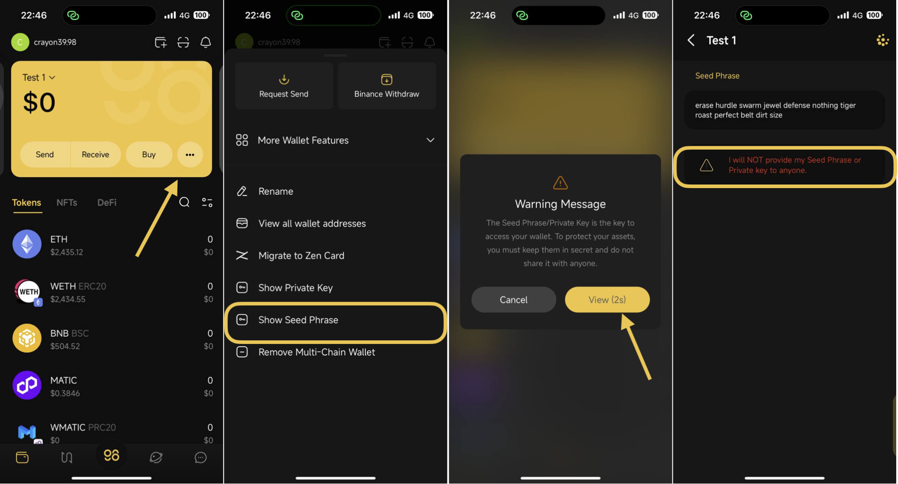
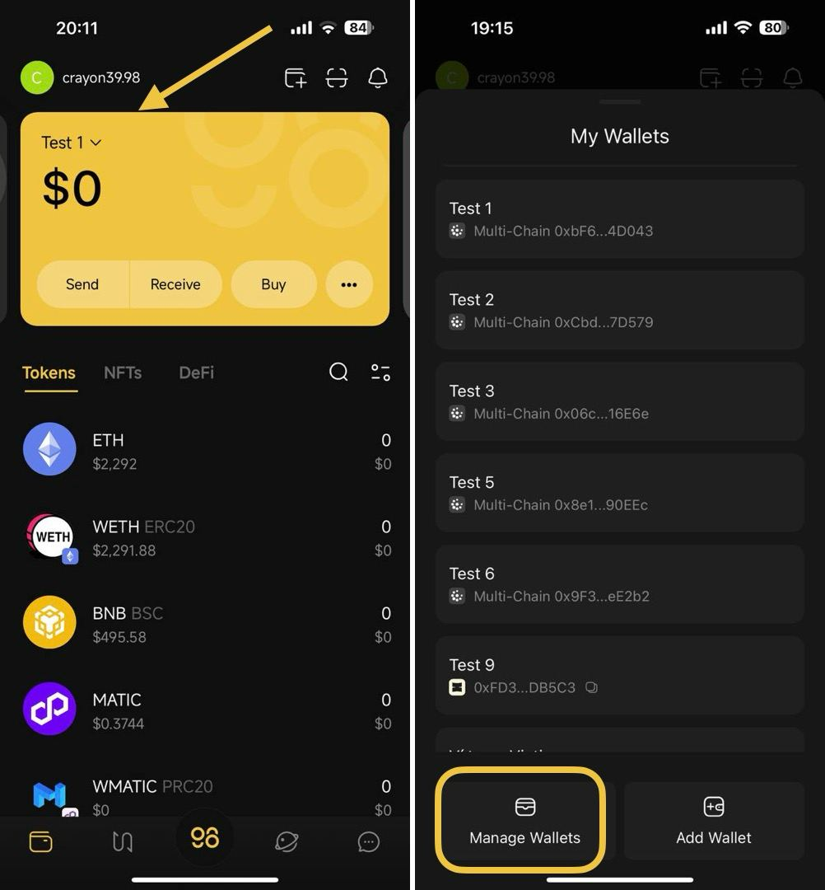
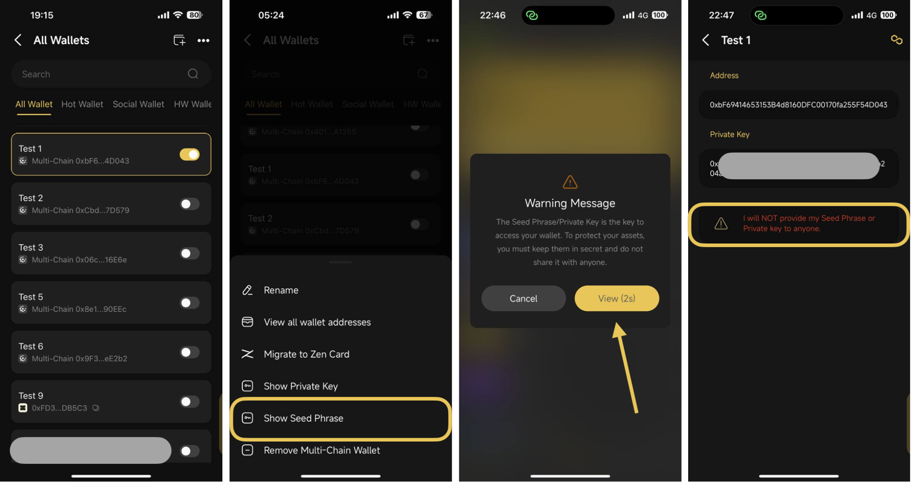
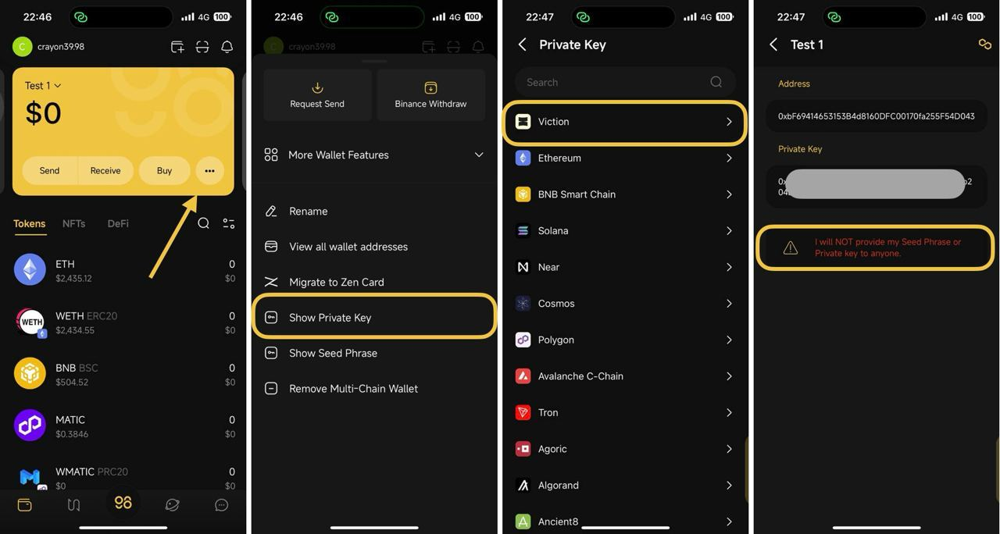
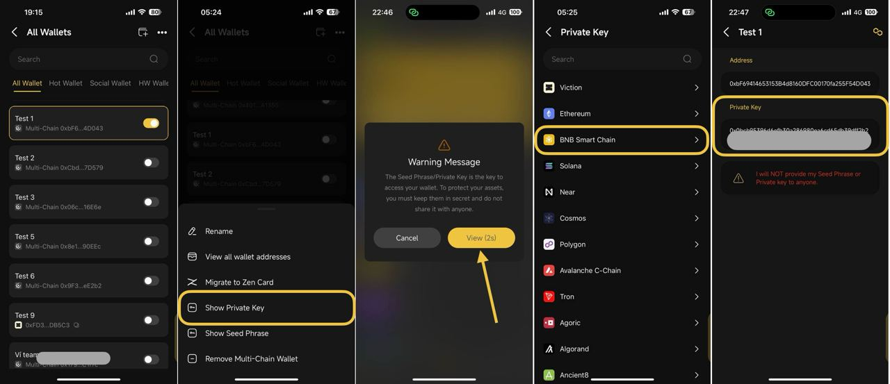

# How to show Seed Phrase / Private key

When creating a wallet on the Coin98 Super Wallet, it's essential to securely store your Seed Phrase or Private Key in a safe location

If you happen to lose or forget your recovery keys, this tutorial will guide you on how to retrieve them, provided the wallet whose keys you forgot is still active on your App


Note: You cannot retrieve recovery keys for the Watch-only wallet


## How to show Seed Phrase

**\*The first way:**&#x20;

**Step 1:** On the main screen of the App, click **More** icon

**Step 2**: Click **Show Seed Phrase**

**Step 3**:  A warning message will appear, reminding you to keep your wallet's seed phrase private and not to share it with anyone. If you understand and accept this warning, click **View** to proceed

<figure><figcaption></figcaption></figure>

**\*The second way:**

**Step 1**: On the mainscreen of the App, click on the currently active Wallet&#x20;

**Step 2**: Choose **Manage Wallets**

<figure><figcaption></figcaption></figure>

**Step 3**: Select the wallet that you would like to retrieve its Seed Phrase

**Step 4**: Click **Show Seed Phrase**

**Step 5**: A warning message will appear, reminding you to keep your wallet's seed phrase private and not to share it with anyone. If you understand and accept this warning, click **View** to proceed

<figure><figcaption></figcaption></figure>

## How to show Private Key

**\*The first way:**

**Step 1**: On the main screen of the App, click **More** icon

**Step 2**: Click **Show Private Key**

**Step 3**:  A warning message will appear, reminding you to keep your wallet's seed phrase private and not to share it with anyone. If you understand and accept this warning, click **View** to proceed

**Step 4**: Select the blockchain of the wallet you would like to retrieve its private key

<figure><figcaption></figcaption></figure>

**\*The second way:**

**Step 1**: On the main screen of the App, click on the currently active Wallet&#x20;

**Step 2**: Choose **Manage Wallets**

<figure><figcaption></figcaption></figure>

**Step 3**: Select the Multichain wallet containing the wallet address whose Private Key you would like to view → then click **Show Private Key**

**Step 4**: A warning message will appear, reminding you to keep your wallet's Seed Phrase/Private Key private and not to share it with anyone. If you understand and accept this warning, click **View** to proceed

**Step 5**: Select the blockchain of the wallet that you would like to retrieve its Private Key

<figure><figcaption></figcaption></figure>
