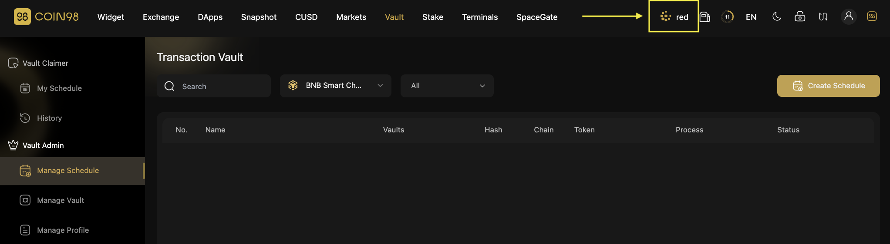

# How to claim Vault with Coin98 Extension

## Preparation

### Install Coin98 Extension

If you are eligible to receive the tokens through Coin98 Vault, you have to install the Coin98 Extension first to connect wallets to [https://vault.coin98.com/](https://vault.coin98.com/).


[install-extension.md](../coin98-super-wallet/extension/beginners-guide/install-extension.md)


### Restore your receiving addresses 

Ignore this step if your receiving addresses are already active in the Manage Wallets section of the Coin98 Extension.


[sync-mobile-with-extension.md](../coin98-super-wallet/extension/beginners-guide/sync-mobile-with-extension.md)


### Prepare father tokens for gas fees 

Coin98 Vault uses the father tokens of each blockchain as **gas fees,** so you have to have these tokens as fees to claim the tokens.


[What is Gas Fee?](https://www.google.com/url?q=https://coin98.net/what-is-gas-fee\&sa=D\&source=editors\&ust=1679192748536237\&usg=AOvVaw16jms6hsBILqZBOBdQPThB)


You can buy the native coins on CEXs like Binance, Kucoin,… and withdraw to the corresponding wallets to experience the product. For layer 2 blockchains like Boba, please convert ETH to the corresponding network to use it.


**Note**: You have to transfer each coin to the corresponding wallet on the correct blockchain.


## How to claim the rewards  

### _On Vault V2_

**Step 1:** Access Coin98 Vault’s homepage [**here.**](https://vault.coin98.com/) Then select **Connect Wallet** at the top right corner of the screen.

<figure><figcaption></figcaption></figure>

**Step 2:** Insert the password to connect your wallet.

**Step 3:** On the **My Schedule** section, check the claim schedule. If it is the right time, select **the Claim icon.**

<figure><figcaption></figcaption></figure>

### _On Vault V1_

You can switch to Vault Version 1 by clicking on "Switch to Vault Version 1"  at the bottom left corner of the interface.

<figure><figcaption></figcaption></figure>

The steps to claim tokens will be similar to the Vault V2. You can refer to the instructions here [#on-vault-v2](how-to-claim-vault-with-coin98-extension.md#on-vault-v2 "mention").
