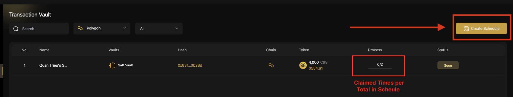

# How to create Vault to distribute tokens

## Preparation

### Install Coin98 Extension

If you are eligible to receive the tokens through Coin98 Vault, you have to install the Coin98 Extension first to connect wallets to [https://vault.coin98.com/](https://vault.coin98.com/).


[install-extension.md](../coin98-super-wallet/extension/beginners-guide/install-extension.md)


### Restore your receiving addresses 

Ignore this step if your receiving addresses are already active in the Manage Wallets section of the Coin98 Extension.


[sync-mobile-with-extension.md](../coin98-super-wallet/extension/beginners-guide/sync-mobile-with-extension.md)


### Prepare father tokens for gas fees 

Coin98 Vault uses the father tokens of each blockchain as **gas fees,** so you have to have these tokens as fees to claim the tokens.


[What is Gas Fee?](https://www.google.com/url?q=https://coin98.net/what-is-gas-fee\&sa=D\&source=editors\&ust=1679192748536237\&usg=AOvVaw16jms6hsBILqZBOBdQPThB)


You can buy the native coins on CEXs like Binance, Kucoin,… and withdraw to the corresponding wallets to experience the product. For layer 2 blockchains like Boba, please convert ETH to the corresponding network to use it.


**Note**: You have to transfer each coin to the corresponding wallet on the correct blockchain.


## How to create your own Vault to distribute tokens&#x20;

This feature is only available on the Coin98 Vault website, allowing users to create their vault to send or distribute the tokens. Here are the supported blockchains on Vault V2:

* BNB Smart Chain
* Viction
* Polygon
* Ethereum
* Avax C-Chain
* Fantom
* Heco Chain
* Ancient8
* Celo
* Arbitrum

To distribute tokens through your own vault, you who is the admin need to follow the stages below.

### _On Vault V2_

#### Stage 1: Create Profile 

**Step 1**: Access [Manage Profile](https://vault.coin98.com/profile-vault) to Create Profile --> Click on **Create Profile** button to create

<figure><figcaption></figcaption></figure>

**Step 2**: In the Vault Version 2.0, the Profile contains the Schedule and Amount. The admin needs to input the distribution time and the amount based on the syntax below:

* Schedule Format: yyyymmddhhmm?amount
* yyyymmddhhmm: the time that the user can claim
* amount: the amount of tokens that the user will receive at that time


**Note**: If there are multiple members who have the same Schedule and amount to claim, then the admin just needs to create one.


<figure><figcaption></figcaption></figure>


**Tips**: Copy 2 columns on Excel

* First column: Schedule yyyymmddhhmm
* Second column: amount


<figure><figcaption></figcaption></figure>

#### Stage 2: Create Vault 

**Step 1**: Access [Manage Vault](https://vault.coin98.com/manage-vault) to Create Vault --> Click on **Create Vault** button to create

<figure><figcaption></figcaption></figure>

**Step 2**: In **Create Vault** form, the admin fills the following information

* Vault Name
* Chain of Vault
* Logo of Vault

<figure><figcaption></figcaption></figure>

After creating the Vault successfully, the Admin will need to **transfer** the Token into the Vault Contract Address. Otherwise, the receiver will not be able to claim tokens.

<figure><figcaption></figcaption></figure>


**Only the tokens** on the list below are supported on Admin Vault V2 and can be sent to Vault Contract. Kindly recheck the token list carefully before transferring any tokens into Vault Contract.


<table><thead><tr><th width="345">Chains</th><th>Tokens</th></tr></thead><tbody><tr><td>Viction</td><td><ul><li>C98</li><li>VIC</li><li>SAROS</li></ul></td></tr><tr><td>BNB Chain</td><td><ul><li>C98</li><li>CUSD</li><li>AURA</li><li>USDT</li><li>BUSD</li><li>USDC</li><li>INS</li><li>ALICE</li><li>HOTCROSS</li><li>DNXC</li><li>IDIA</li><li>RACA</li><li>OSWAP</li><li>THG</li><li>RENA</li><li>DNFT</li><li>DAR</li><li>EBA</li><li>GSTS</li><li>DREAMS</li><li>OGS</li><li>GRBE</li><li>THE</li></ul></td></tr><tr><td>Ethereum</td><td><ul><li>C98</li><li>CUSD</li><li>USDC</li><li>ALICE</li><li>C3</li><li>HOTCROSS</li><li>DAR</li><li>GF</li><li>LEVER</li></ul></td></tr><tr><td>Avax</td><td><ul><li>JOE</li><li>USDC</li></ul></td></tr><tr><td>HECO Chain</td><td><ul><li>HUSD</li></ul></td></tr><tr><td>Polygon</td><td><ul><li>C98</li></ul></td></tr><tr><td>Arbitrum</td><td><ul><li>USDT</li></ul></td></tr><tr><td>Ancient8</td><td><ul><li>EIGHTEEN</li><li>HAIRY</li></ul></td></tr><tr><td>Celo</td><td> -</td></tr><tr><td>Fantom</td><td> -</td></tr></tbody></table>

#### Stage 3: Create Schedule 

**Step 1**: Access [Manage Schedule](https://vault.coin98.com/schedule) to Create Schedule --> Click on **Create Schedule** button to create

<figure><figcaption></figcaption></figure>

**Step 2**: Admin will need to create **Schedule** for each Member/Receiver/Claimer.


In Vault Version 2.0, the Schedule will map the Vault Pool with the User’s address, then the user can claim the Vault based on the Time and amount in the User’s Profile.


<figure><figcaption></figcaption></figure>

Admin needs to fill in the following information

<table><thead><tr><th width="158">Field</th><th>Description</th><th></th></tr></thead><tbody><tr><td><strong>Token</strong></td><td>The Token &#x26; its chain that the user will receive</td><td></td></tr><tr><td><strong>Vault</strong></td><td>Choose the Vault Pool that user will claim. This Vault is filtered by Chain of Token above </td><td></td></tr><tr><td><strong>Schedule Name &#x26; Description</strong></td><td>Input the name &#x26; description</td><td></td></tr><tr><td><strong>Address</strong></td><td>The address can claim this Vault</td><td></td></tr><tr><td><strong>Message Notification</strong></td><td>The Notification that user will receive in Coin98 Super Wallet</td><td></td></tr><tr><td><strong>Schedule Data</strong></td><td>Click on <strong>Import Profile</strong> button, then select the Profile that the user will claim</td><td> </td></tr></tbody></table>


After the tokens are distributed, the receivers can claim through their Coin98 Vault


<figure><figcaption></figcaption></figure>


**Note**: If your Vault is on Version 1 or on Solana network, kindly switch to Version 1 to claim your tokens.


### _On Vault V1_

You can switch to Vault Version 1 by clicking on "Switch to Vault Version 1"  at the bottom left corner of the interface.

<figure><figcaption></figcaption></figure>

The steps to create your own vault, and distribute tokens in Vault V1 will be similar to the Vault V2. You can refer to the instructions here [#on-vault-v2](how-to-create-vault-to-distribute-tokens.md#on-vault-v2 "mention").
